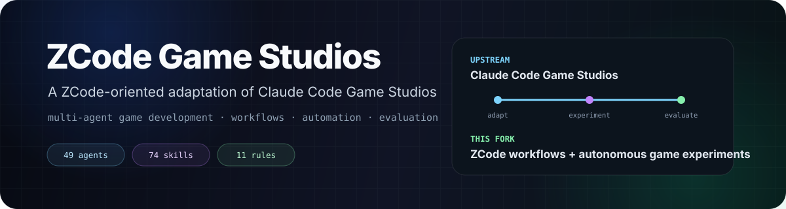

 

  

**面向 ZCode 的游戏开发多智能体工作流、自动执行与评测实验版本。**

> [!IMPORTANT]
> 本仓库基于原项目 **[Claude Code Game Studios](https://github.com/Donchitos/Claude-Code-Game-Studios)**。  
> 仓库此前使用的项目 README 已经**原样保留**为 **[README.original.md](./README.original.md)**。  
> 当前 README 主要介绍我如何定位和使用这个分支，并不替代原项目文档，也不改变原作者归属。

---

## 这个分支是什么？

原项目的核心思想，是把一次 AI 编程会话组织成一个具有明确分工的“游戏工作室”：由不同 Agent、技能、规则、Hook 和生产流程共同完成游戏开发。

这个仓库是我围绕这个体系进行的 **ZCode 适配与实验分支**。

当前首页不再重复原项目那份非常完整的长文档，而重点介绍我关注的三件事：

<table>
<tr>
<td width="33%" valign="top">

### 🎮 多智能体游戏开发
使用导演、部门负责人和专业 Agent 组成工作室式结构，覆盖设计、编程、美术、QA、生产和发布。

</td>
<td width="33%" valign="top">

### 🤖 ZCode 工作流适配
仓库使用 <code>.zcode/</code> 下的 agents、skills、rules 和工作流资产，使这套 Studio 更适合在 ZCode 环境中使用。

</td>
<td width="33%" valign="top">

### 🌙 自动化游戏实验
例如 <code>/auto-game-in-sleep</code>，用于探索游戏开发流程能够在多大程度上被串联、自动执行、测试、评审并持续迭代。

</td>
</tr>
</table>

---

## 当前仓库概览

| 组成 | 当前数量 / 状态 |
|---|---:|
| 专业 Agent | **49** |
| Skills / Slash 工作流 | **74** |
| 路径级 Rules | **11** |
| 文档模板 | **41** |
| 主要使用环境 | **ZCode-oriented** |
| 涵盖游戏引擎 | **Godot · Unity · Unreal** |

完整功能清单、Hook 行为、安装方式、工作流目录和设计理念请直接查看保留下来的 **[原项目 README](./README.original.md)**。

---

## 我关注的核心问题

我使用这个项目时，重点并不只是“让大模型生成一个游戏”，而是研究更完整的 **Agent 系统 + 评测流程**：

~~~text
游戏概念
   │
   ▼
多智能体规划
   │
   ├── 设计
   ├── 架构
   ├── 实现
   ├── 资产
   ├── QA
   └── 生产
   │
   ▼
构建 / 运行 / 检查
   │
   ▼
独立评审
   │
   ▼
继续迭代
~~~

真正值得实验的问题是：

> 一套由 Agent、Rules、Tools、质量门槛和执行循环组成的结构化系统，能不能让 AI 游戏开发变得更加**可复现、可检查、可评测**？

---

## 仓库结构

比较重要的目录：

| 路径 | 用途 |
|---|---|
| [<code>.zcode/agents/</code>](./.zcode/agents) | 专业 Agent 定义 |
| [<code>.zcode/skills/</code>](./.zcode/skills) | Slash Command / 工作流技能 |
| [<code>.zcode/rules/</code>](./.zcode/rules) | 路径级开发规范 |
| [<code>.zcode/docs/</code>](./.zcode/docs) | 工作流元数据与模板 |
| [<code>ccgs-studio-hooks/</code>](./ccgs-studio-hooks) | 可选自动化与安全 Hook |
| [<code>production/</code>](./production) | 计划、里程碑、自动运行状态与报告 |
| [<code>design/</code>](./design) | 游戏设计文档 |
| [<code>src/</code>](./src) | 游戏实现区域 |

---

## 自动游戏工作流

这个分支里我最关注的部分之一，是 <code>/auto-game-in-sleep</code>。

它希望把多阶段游戏开发流程串成一个连续执行链：

**概念 → 设计 → 架构 → 实现 → 构建 → 游玩测试 → 评审 → 迭代**

具体的安全限制、验收门槛、状态文件、独立评审和返回报告机制，在保留的原 README 中有完整说明：

**[查看原 README 中的 Unattended Autonomy](./README.original.md#unattended-autonomy-auto-game-in-sleep)**

---

## 相关公开评测

我也把 AI 游戏生成相关的公开评测放到了个人 Browser Lab：

**[AI 游戏生成评测 · 第二届](https://zyh.sryze.cc/projects/game-studio-eval-s2/)**

它可以作为这个仓库内部 Agent / 工作流实验的公开展示补充。

---

## 快速开始

完整安装和使用方法请以保留下来的原项目文档为准：

**[打开原 Getting Started →](./README.original.md#getting-started)**

简化流程：

1. 克隆仓库；
2. 使用 ZCode 打开目录；
3. 运行 <code>/start</code> 进入引导流程；
4. 或直接运行 <code>/brainstorm</code>、<code>/setup-engine</code>、<code>/project-stage-detect</code> 等具体技能。

---

## 原项目与归属

本仓库建立在：

**[Donchitos / Claude-Code-Game-Studios](https://github.com/Donchitos/Claude-Code-Game-Studios)**

之上。

原项目的文档、架构、Agent、工作流及其他上游成果仍归属于对应原作者和贡献者。

为了不丢失这些上下文，仓库原先使用的 README 已完整保留：

**[README.original.md](./README.original.md)**

---

当前 README 用于说明我的分支定位与使用方式。原项目的权威说明请参考上游仓库以及本仓库保留的原 README。

